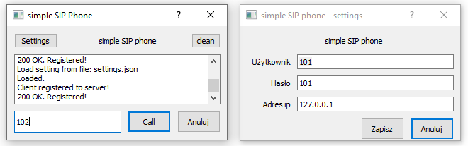
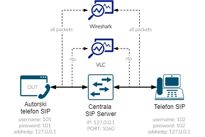
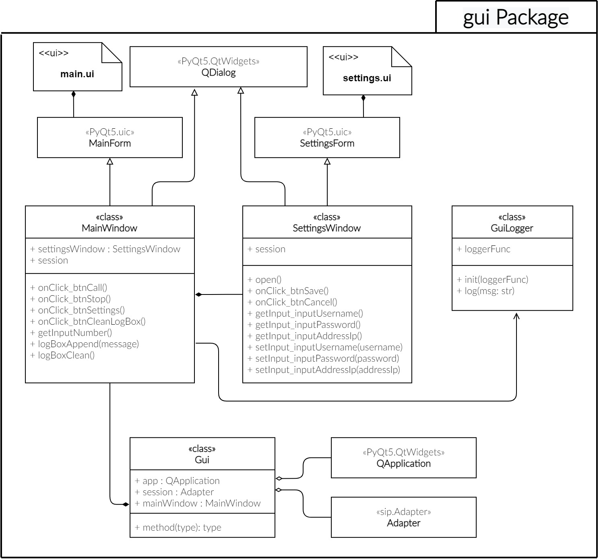
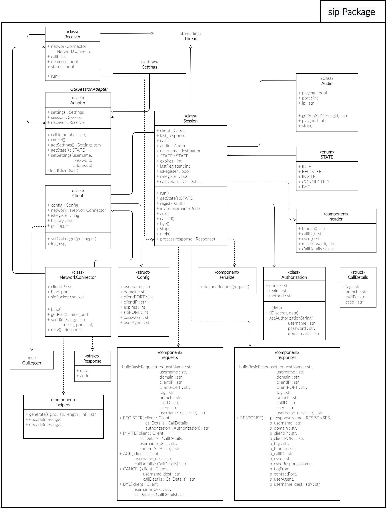
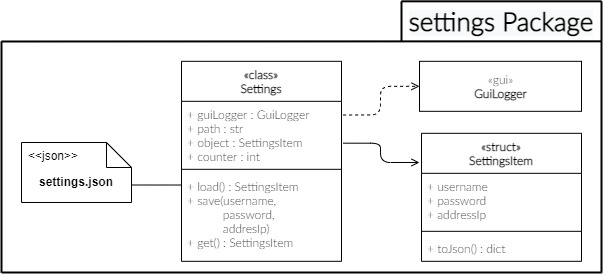
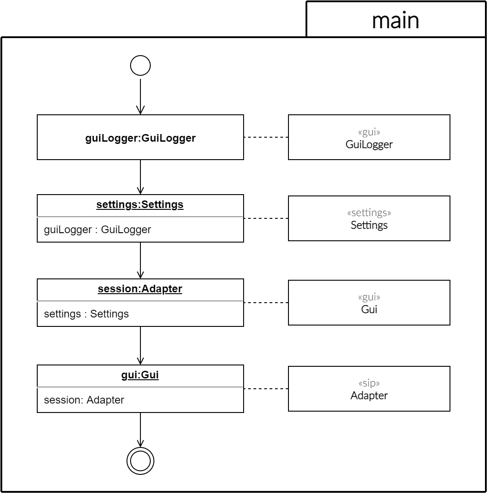
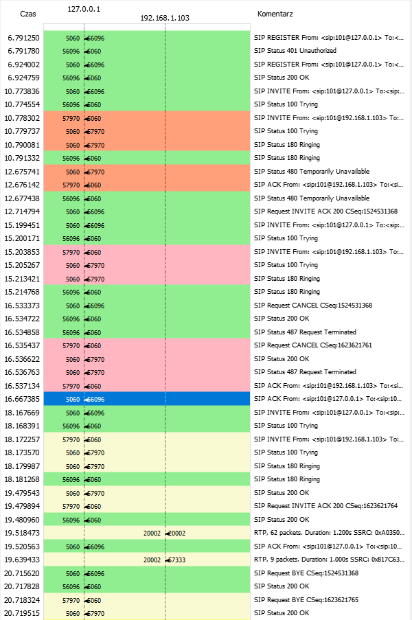

# SIP-Client

It is simple SIP phone made for Univerity (PWr) Project purpose: 
> Metody obsługi i analiza możliwości protokołu SIP za pomocą narzędzi programistycznych

The project was made in *Polish language*, so part of gui interface you can find out is in *Polish*.

Project created only for a specifics test scenario and its not recommended to use in any commercial case (incomplete, without network security). (for educational purpose only)

## 1. Application GUI:

## 2. Tests line:

## 3. Class diagram gui:

## 4. Class diagram sip

## 5. Class diagram settings

## 6. Main script flow (objects creations) for run the program

## 7. Wireshark flow on test line

Note: project will be abandoned as soon as we receive the grade :P
We got highest grade (5.5), so project have been officially closed!
